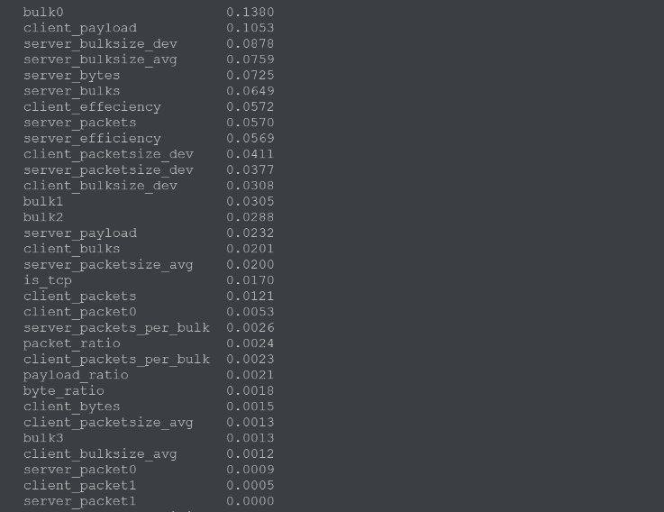
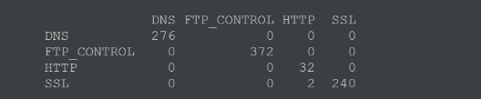
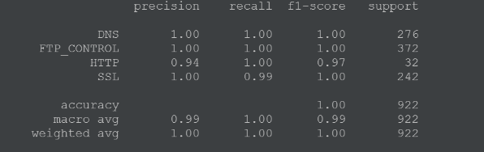

# network-traffic-analyzer

## Description
Repo create model for analyze Ethernet package and predict it's protocol.

## Basic steps
* Get **.pcapng** file. Use [Wireshark](https://www.wireshark.org/download.html)
* Convert **.pcapng** file to **.csv** (works only in unix system)
    * Convert **.pcapng** file to **.pcap**
        > editcap -F libpcap -T ether test.pcapng test.pcap
    * Move **.pcap** file to *tools/pcap2csv* directory
    * Convert **.pcap** file to **.cs**
        > python main.py -p test.pcap -o test.csv
* Run **main.py**
    > python main.py test.csv -o test.model -r 42
 ## Results

